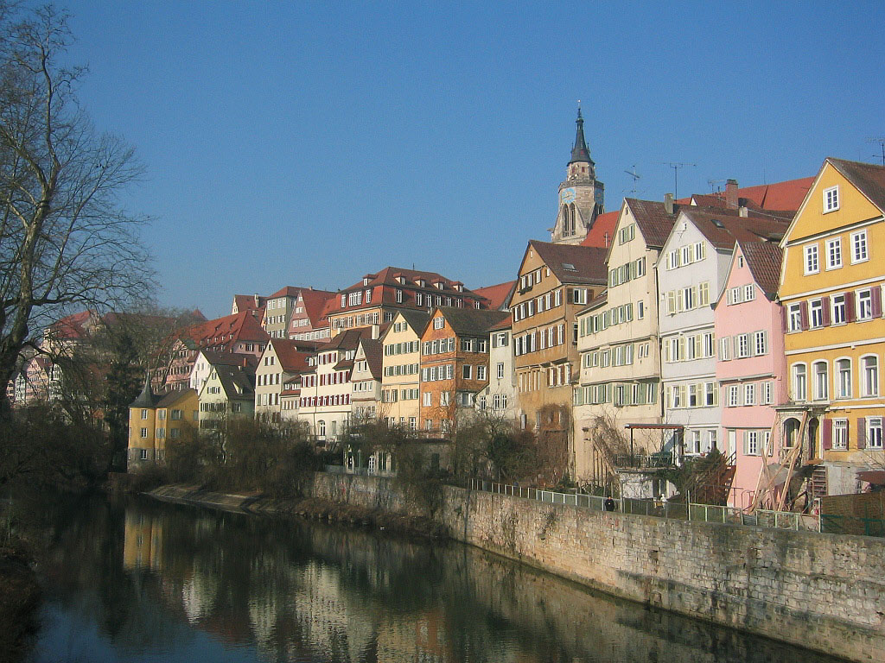
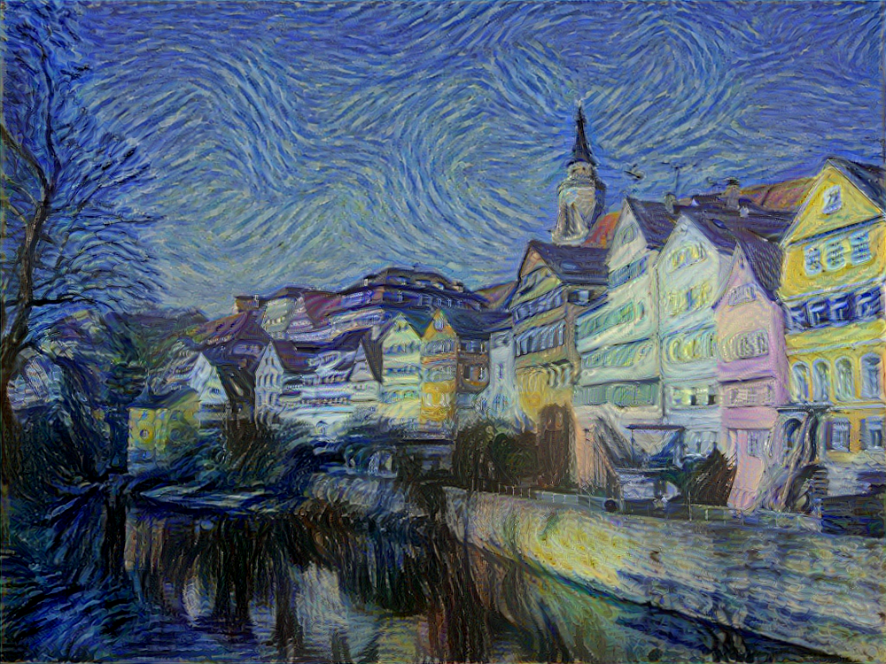
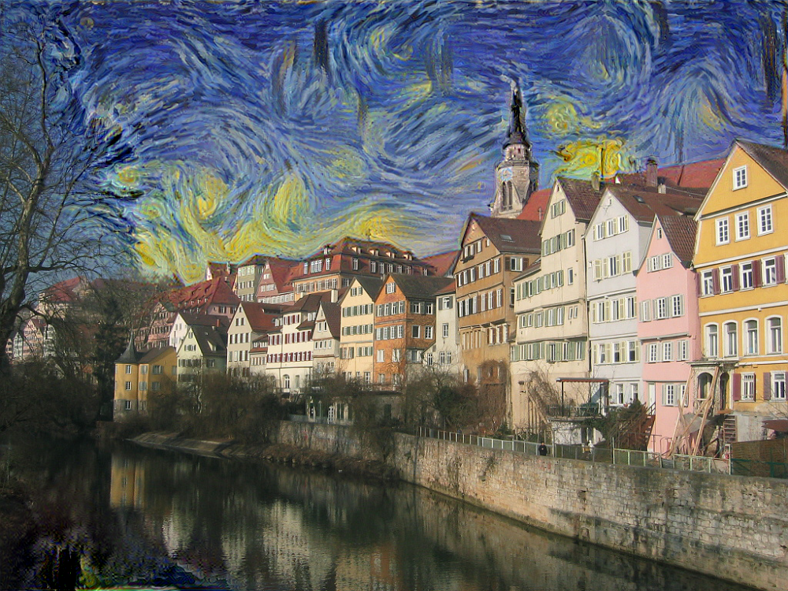
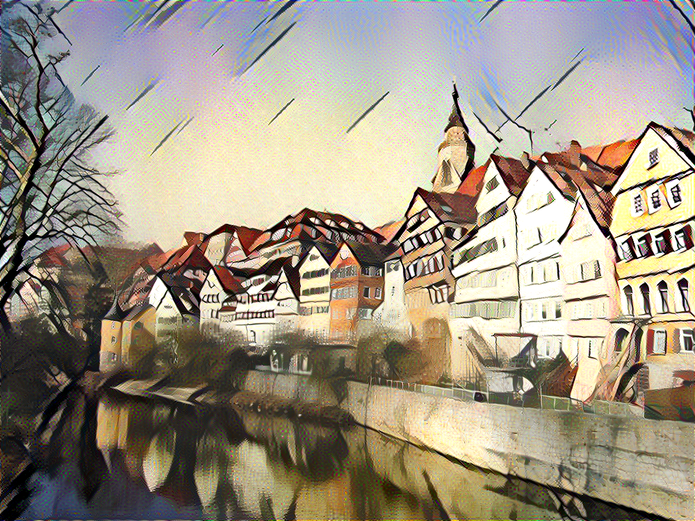
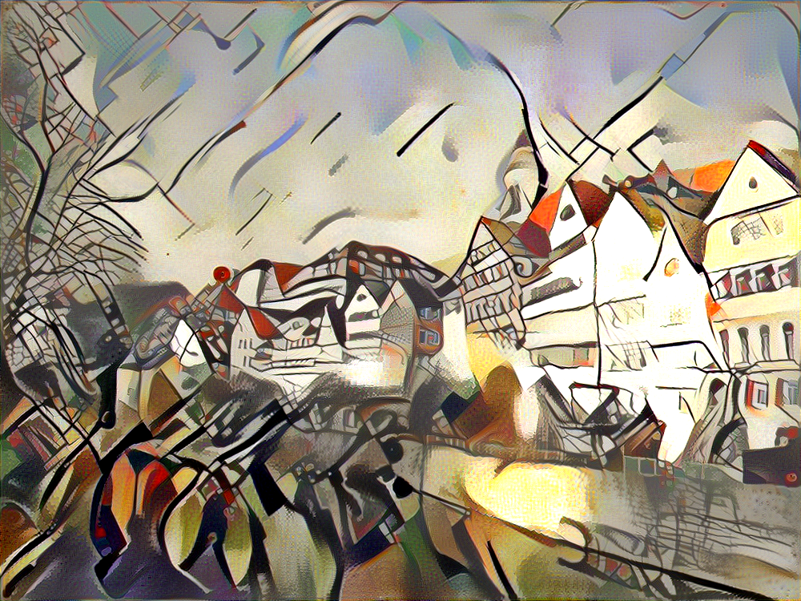
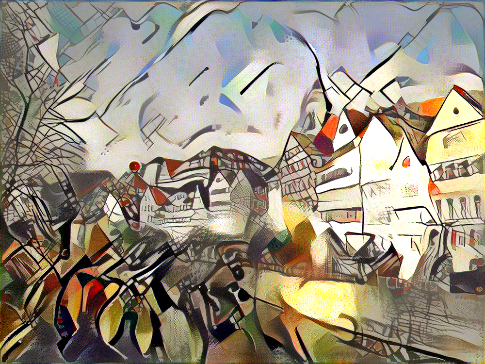
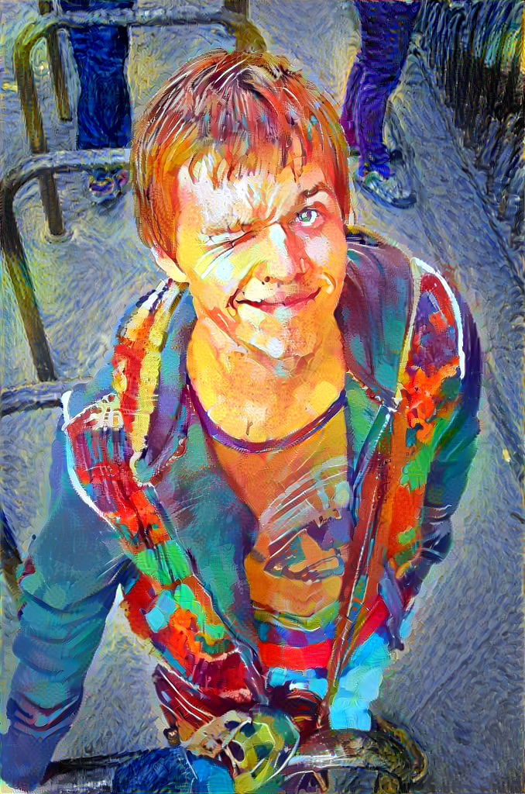

# Styl eTransfer in TouchDesigner

This is a TouchDesigner implementation of the Style Transfer using Neural Networks. Project is based on 
* [TensorFlow (Python API) implementation of Neural Style](https://github.com/cysmith/neural-style-tf) by [cysmith](https://github.com/jcjohnson) 

You can read about underlying math of the algorithm [here](https://harishnarayanan.org/writing/artistic-style-transfer/) 

Here is some results next to the original photo:
<p align="center">







</p>


## Setup

0. Install [TouchDesigner](https://www.derivative.ca/099/Downloads/)
1. Install [Tensorflow for Windows](https://www.tensorflow.org/install/install_windows). It's higly recomended to use GPU version (so, you'll also need do install [CUDA](https://developer.nvidia.com/cuda-downloads) and, optionally, [cuDNN](https://developer.nvidia.com/cudnn)). You can install Tensorflow directly to Python directory or with [Anaconda](https://conda.io/docs/download.html).
2. In TouchDesigner menu `Edit - Preferences - Python 32/64 bit Module Path` add path to folder, where Tensorflow is installed (i.e. C:/Anaconda3/envs/TFinTD/Lib/site-packages). [Details](http://www.derivative.ca/wiki099/index.php?title=Introduction_to_Python_Tutorial#Importing_Modules). To check your installation run in Textport (Alt+t):
```
import tensorflow as tf
hello = tf.constant('Hello, TensorFlow!')
sess = tf.Session()
print(sess.run(hello))
```
If the system outputs `Hello, TensorFlow!`, then Tensorflow in TouchDesigner works well.
3. Run command line or Powershell, activate conda enviroment (if Tensorflow was installed in conda) and install:
* numpy
* scipy
* opencv (OpenCV preinstalled in TouchDesigner 099 works fine, but for 088 you should install it manually in Python (or conda))
4. [Override built-in numpy module](http://www.derivative.ca/wiki099/index.php?title=Introduction_to_Python_Tutorial#Overriding_built_in_modules). To check in TouchDesigner Textport enter
```
import numpy
numpy
```
You should see path to numpy in your Python directory or Conda enviroment (i.e. `C:/Anaconda3/envs/TFinTD/Lib/site-packages\\numpy\\__init__.py`)
5. Download the [VGG-19 model weights](http://www.vlfeat.org/matconvnet/pretrained/) (see the "VGG-VD models from the *Very Deep Convolutional Networks for Large-Scale Visual Recognition* project" section). After downloading, copy the weights file `imagenet-vgg-verydeep-19.mat` to the project directory or set path to it, using Style transfer user interface in TouchDesigner (`StyleTransfer.toe` last row `Path to VGG` in UI).

## Usage
### Basic Usage
1. It's recomended to copy all images you need inside project folder derectories `/input` and `/styles` (or create your own directories). Long absolute paths cannot work sometimes (especially in windows %USER% folder) 
2. Choose content image in `input` TOP
3. Choose style image in `style1` TOP
4. Press `Run Style Transfer` in UI
5. Wait. TouchDesigner wouldn't respond for some seconds or minutes (depend on your GPU and resolutions of the images).
6. Result will be in `result` TOP, linked to a file in /output/ folder. Log with some info is in `log` DAT - save it somewhere, if needed.
7. Experiment with settings
8. Experiment with the code in `/StyleTransfer/local/modules/main` DAT
9. If something isn't working - first check errors in Textport


#### Settings
* You can always `load default parameters`, when experiments goes too far.
* `Num of iterations` - Maximum number of iterations for optimizer: larger number increase an effect of stylization.
* `Maximum resolution` - Max width or height of the input/style images. High resolutions increases time and GPU memory usage. Good news: you don't need Commercial version of TouchDesigner to produce images larger than 1280×1280.
* You can perform style transfer on `GPU or CPU device`. GPU mode is many times faster and highly recommended, but requires NVIDIA CUDA (see Setup section)
* You can transfer more than one style to input image. Set `number of styles`, weight for each of it and choose files in style TOPs. If you want to go beyond 5 styles — make changes in /StyleTransfer/UI/n_styles
* `Use style masks` if you want to apply style transfer to specific areas of the image. Choose masks in stylemask TOPs. Style applied to white regions.
* `Keep original colors` if the style is transferred but not the colors.
* `Color space convertion`: Color spaces (YUV, YCrCb, CIE L\*u\*v\*, CIE L\*a\*b\*) for luminance-matching conversion to original colors.
* `Content_weight` - Weight for the content loss function. You can use numbers in [scientific e notation](http://www.onlineconversion.com/faq_06.htm)
* `Style_weight` - Weight for the style loss function.
* `Temporal_weight` - Weight for the temporal loss function.
* `Total variation weight` - Weight for the total variational loss function.
* `Type of initialization image` - You can initialize the network with `content`, `random` (noise) or `style` image.
* `Noise_ratio`: Interpolation value between the content image and noise image if network is initialized with `random`.
* `Optimizer` - Loss minimization optimizer.  L-BFGS gives better results. Adam uses less memory.`
* `Learning_rate` - Learning-rate parameter for the Adam optimizer. 
<p align="center">

</p>

* `VGG19 layers for content\style image`: [VGG-19](http://www.robots.ox.ac.uk/~vgg/research/very_deep/) layers and weights used for the content\style image.
* `Constant (K) for the lossfunction` - Different constants K in the content loss function. 
<p align="center">

</p>

* `Type of pooling in CNN` - Maximum or average ype of pooling in convolutional neural network.
* `Path to VGG file`: Path to `imagenet-vgg-verydeep-19.mat` Download [here](http://www.vlfeat.org/matconvnet/pretrained/).


## Memory
By default, Style transfer uses the NVIDIA cuDNN GPU backend for convolutions and L-BFGS for optimization.
These produce better and faster results, but can consume a lot of memory. You can reduce memory usage with the following:

* **Use Adam**: Set `Optimizer` to Adam instead of L-BFGS. This should significantly reduce memory usage, but will require tuning of other parameters for good results;
 in particular you should experiment with different values of `Learning rate`, `Content weight`, `Style_weight`.
* **Reduce image size**: You can reduce the size of the generated image with the `Maximum resolution` setting.


## This code was generated and tested on system:
* **CPU:** Intel Core i7-4790K @ 4.0GHz × 8 
* **GPU:** NVIDIA GeForce GTX 1070 8 Gb
* **CUDA:** 8.0
* **cuDNN:** v5.1
* **OS:** Windows 10 64-bit
* **TouchDesigner:** 099 64-bit built 2017.10000
* **Anaconda:** 4.3.14
* **tensorflow-gpu:** 1.2.0 
* **opencv:** 3.2.0-dev (used built-in TouchDesigner)
* **numpy:** 1.13.0 (used version installed in conda enviroment)
* **scipy:** 0.19.1 (used version installed in conda enviroment)


## The implementation is based on the project: 
* [TensorFlow (Python API) implementation of Neural Style](https://github.com/cysmith/neural-style-tf) by [cysmith](https://github.com/jcjohnson)


## Contacts
Contact me via exsstas@ya.ru or in [Twitter](https://twitter.com/exsstas)

<p align="center">

</p>